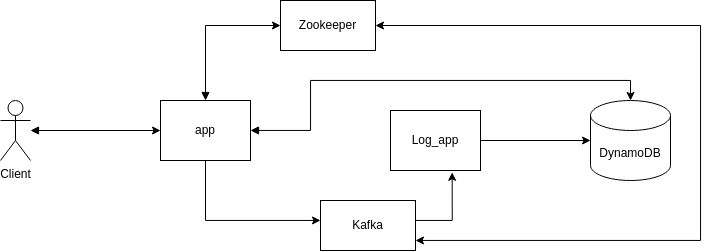
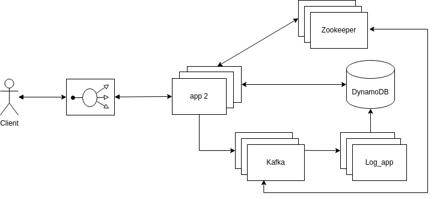

# url-shortener

## How to run

This application run on 5 Docker containers:
- Main app (API Rest)
- Log app (Receive and save Logs)
- DynamoDB (Database for all data)
- Zookeeper (Coordination and state of applications)
- Kafka (Component for boosting log functionality)

These applications are orchestrated by docker-compose. This system run three different environments **Development local, Development Docker and Production**.  

* **Development local** environment is hosted in **dev** git branch, it runs the **Main app** and **Log app** on local host and the other components in docker. To run this environment use command `docker-compose -f docker-compose-local.yml up` . To run the **Main app**, create the Python virtual environment with this [./app/requirements.txt](./app/requirements.txt) and activate it, set the next environment variables `FLASK_APP=app ; FLASK_ENV=development; TYPE_DEPLOY=development_local`, go to [app folder](./app) and run command `flask run`. To run **log_app** application, create the Python virtual environment with this requirements [./log_app/requirements.txt](./log_app/requirements.txt) and activate it, set the next environment variable `TYPE_DEPLOY=development_local`,  and go to [log_app folder](./log_app) and run command `python log_app.py`.  

* **Development local** environment is hosted in **dev** git branch and  runs completely in Docker, to run this environment use command `docker-compose up`.  
  
* **Development production** environment is hosted in **prod** git branch and runs completely in Docker, to run this environment use command `docker-compose up`.

## Endpoints:
### Get an URL save
- URL -> http://localhost:5000/<code>
- METHOD -> GET
- PARAMS -> Required: code=[String]]
- SUCCESS RESPONSE -> redirection to URL corresponding to \<code\>
- ERROR RESPONSE ->  204 Error if not content found, 500 if internal error
- SAMPLE CALL -> http://localhost:5000/3bj7  
  
### Save and URL
- URL -> http://localhost:5000/api/v1/create
- METHOD -> POST
- PARAMS -> Required: link=[String]]
- SUCCESS RESPONSE -> JSON element with the corresponding short URL
- ERROR RESPONSE ->  204 Error if not content found, 500 if internal error
- SAMPLE CALL -> http://localhost:5000/api/v1/create  (with the corresponding payload {link: <link-url>)  
  
### Delete an URL
- URL -> http://localhost:5000/api/v1/delete/<code>
- METHOD -> DELETE
- PARAMS -> Required: code=[String]]
- SUCCESS RESPONSE -> JSON element the message of success
- ERROR RESPONSE ->  204 Error if not content found, 500 if internal error
- SAMPLE CALL -> http://localhost:5000/api/v1/delete/3bj7   
   
## Data Model
The database model consist in two tables:
- link
- log_internal

The 'link' table contains the link logic, where the key (column=index_link) is the code placed in the short URL and this key has two values, the long link (column=long_link) and the creation date (column=creation_date).

The 'log_internal' table contains the Logs of the links-url operations, consists in one column key (column=date_event) and 4 values (column=[type_event, short_link, long_link, type_client])

## Demo architecture

## Scaled architecture

 
